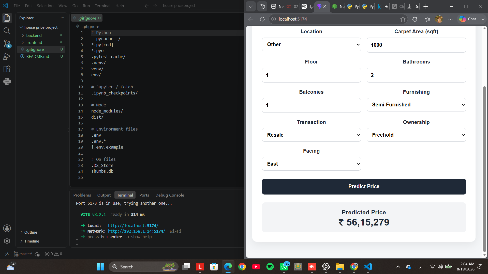

# House Price Prediction

An end-to-end machine-learning web application that predicts house prices from property details.

The project follows the Student Project Guide: a reproducible Jupyter notebook for data cleaning, EDA, feature engineering and model comparison; a FastAPI backend serving the trained pipeline; and a React + TypeScript frontend with a result page.

> **Important:** `backend/models/house_price.pkl` is about 115 MB. The project keeps it in the local ZIP so the app can run immediately, but `.gitignore` excludes it from GitHub because the guide only permits committing the model when it is below 50 MB. Keep a copy locally or use the course-approved artifact/LFS mechanism when publishing.

## Architecture

```text
Kaggle dataset
     │
     ▼
Jupyter Notebook
(cleaning → EDA → feature engineering → 2 models → test metrics)
     │
     ├──► backend/models/house_price.pkl
     └──► backend/models/locations.json
                 │
                 ▼
        FastAPI backend :8000
          /health /locations /predict
                 │
                 ▼
       React + TypeScript :5173
          /  /result  /404
```

## Tech stack

- Python 3.11+
- Jupyter / pandas / NumPy / scikit-learn
- FastAPI + Pydantic + Uvicorn
- React + TypeScript + Vite
- React Router
- pytest + FastAPI TestClient

## Project structure

```text
house-price-project/
├── backend/
│   ├── app/
│   │   ├── api/routes/prediction.py
│   │   ├── core/config.py
│   │   ├── schemas/prediction.py
│   │   └── services/
│   │       ├── inference.py
│   │       └── preprocessing.py
│   ├── models/
│   │   ├── house_price.pkl
│   │   └── locations.json
│   ├── tests/test_prediction.py
│   ├── .env.example
│   └── requirements.txt
├── frontend/
│   ├── src/
│   │   ├── api/predictionClient.ts
│   │   ├── components/PredictionForm.tsx
│   │   ├── pages/
│   │   │   ├── HomePage.tsx
│   │   │   ├── ResultPage.tsx
│   │   │   └── NotFoundPage.tsx
│   │   └── App.tsx
│   ├── .env.example
│   ├── package.json
│   └── vite.config.ts
├── notebooks/
│   ├── data/                 # put house_prices.csv here; ignored by Git
│   ├── house_price_model.ipynb
│   └── requirements.txt
├── .gitignore
└── README.md
```

## Dataset

Dataset: **House Price by Juhi Bhojani**  
https://www.kaggle.com/datasets/juhibhojani/house-price

The course guide specifies the dataset file `house_prices.csv`.

### Download

Option A — download the ZIP manually from Kaggle, unzip it, and put:

```text
notebooks/data/house_prices.csv
```

Option B — with the Kaggle CLI:

```bash
pip install kaggle
kaggle datasets download -d juhibhojani/house-price -p notebooks/data --unzip
```

Do not commit the raw CSV.

## Machine-learning notebook

Open:

```text
notebooks/house_price_model.ipynb
```

The notebook contains:

1. Load and inspect
2. Data cleaning and type conversion
3. Exploratory data analysis
4. Feature engineering
5. Outlier handling
6. High-cardinality location grouping
7. Train/test split
8. Preprocessing pipeline
9. Linear Regression baseline
10. Random Forest Regressor
11. Test-set MAE, RMSE and R²
12. Model comparison and selection
13. Predicted-vs-actual plot
14. Model export
15. Reload sanity check

The notebook exports the complete scikit-learn pipeline and `locations.json` into:

```text
backend/models/
```

### Notebook setup

From the project root:

```powershell
python -m pip install -r notebooks/requirements.txt
```

Then place the dataset in `notebooks/data/` and run the notebook top-to-bottom.

## Model evaluation

The current project run selected **Random Forest** because it had the best test-set results.

| Model | MAE | RMSE | R² |
|---|---:|---:|---:|
| Linear Regression | ~4.56M | ~7.51M | ~0.720 |
| Random Forest | ~1.09M | ~4.11M | ~0.916 |

Lower MAE/RMSE is better; higher R² is better.

Re-run the notebook after downloading the dataset to regenerate the exact metrics and artifacts.

## Backend setup

Open a terminal:

```powershell
cd backend
python -m venv .venv
```

Windows PowerShell:

```powershell
Set-ExecutionPolicy -Scope Process -ExecutionPolicy Bypass
.\.venv\Scripts\Activate.ps1
```

Install dependencies:

```powershell
python -m pip install -r requirements.txt
```

Create the environment file:

```powershell
copy .env.example .env
```

Start FastAPI:

```powershell
uvicorn app.main:app --reload --port 8000
```

Open the API docs:

```text
http://localhost:8000/docs
```

Health check:

```text
http://localhost:8000/health
```

## Backend environment variables

| Variable | Example | Purpose |
|---|---|---|
| `CORS_ORIGINS` | `http://localhost:5173,http://localhost:5174` | Allowed frontend origins |
| `MODEL_PATH` | `models/house_price.pkl` | Path to the trained pipeline |

The model is loaded once during FastAPI startup using the application lifespan.

## API reference

### `GET /health`

Response:

```json
{
  "status": "ok"
}
```

### `GET /locations`

Returns the exact location values exported by the notebook.

```json
{
  "locations": ["Other", "agra", "ahmedabad"]
}
```

### `POST /predict`

Example request:

```powershell
curl.exe -X POST "http://localhost:8000/predict" `
  -H "Content-Type: application/json" `
  --data-raw "{\"location\":\"mumbai\",\"carpet_area_sqft\":1000,\"floor_num\":1,\"bathroom\":2,\"balcony\":1,\"furnishing\":\"Semi-Furnished\",\"transaction\":\"Resale\",\"ownership\":\"Freehold\",\"facing\":\"East\"}"
```

Example response:

```json
{
  "predicted_price": 5615279.0
}
```

The API uses the same feature names and preprocessing pipeline used during training. Unknown locations are mapped to `Other`.

## Backend tests

Run:

```powershell
pytest -q
```

The test suite includes:

- a successful prediction request
- invalid input validation (`422`)

## Frontend setup

Open a second terminal:

```powershell
cd frontend
npm install
```

Create:

```text
frontend/.env
```

with:

```env
VITE_API_BASE_URL=http://localhost:8000
```

Start Vite:

```powershell
npm run dev
```

Open the URL printed by Vite, normally:

```text
http://localhost:5173/
```

If port 5173 is busy, Vite may choose 5174; use the URL printed in the terminal.

## Frontend environment variables

| Variable | Example | Purpose |
|---|---|---|
| `VITE_API_BASE_URL` | `http://localhost:8000` | FastAPI base URL |

The location dropdown is loaded from the backend's `locations.json` export instead of a hard-coded city list.

## Frontend routes

- `/` — prediction form
- `/result` — formatted prediction result
- `/404` — not-found page

The frontend includes client-side validation, loading state, API error handling, and formatted Indian-number price output.

## Build verification

Frontend production build:

```powershell
npm run build
```

Backend tests:

```powershell
pytest -q
```

## GitHub publishing

Before the first commit, verify:

```text
.env
.venv/
node_modules/
dist/
notebooks/data/
*.csv
backend/models/house_price.pkl
```

are ignored.

The course guide says the model may be committed only if it is **under 50 MB**. This model is larger, so do not push it directly to a normal GitHub repository.

For a public submission, keep the code/notebook/README in GitHub and provide the model through the submission mechanism or storage method allowed by the course.

## Screenshots

The repository includes a real capture of the running frontend with the prediction form and displayed result:



The screenshot is kept as a direct application capture; no outdated or misleading location-dropdown screenshot is referenced.

## Final submission checklist

- [x] Notebook at `notebooks/house_price_model.ipynb`
- [x] EDA and data cleaning
- [x] At least two regression models
- [x] Test-set MAE / RMSE / R²
- [x] Exported pipeline and locations
- [x] FastAPI `/health`, `/locations`, `/predict`
- [x] Startup model loading with FastAPI lifespan
- [x] Pinned scikit-learn version
- [x] CORS restricted to local frontend origins
- [x] Two backend tests
- [x] Frontend API base URL from `VITE_API_BASE_URL`
- [x] Location dropdown loaded from exported locations
- [x] `/`, `/result`, and 404 routes
- [x] `.env.example` files
- [x] `.gitignore` excludes raw data, environments and the large model
- [ ] Run the notebook with the downloaded CSV and verify all cells
- [x] Add application screenshots
- [ ] Verify the project from a fresh clone using only this README
